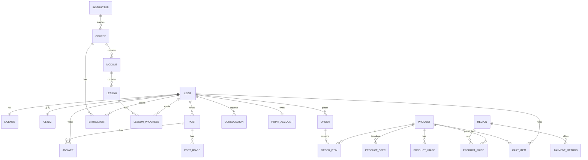

# 닥터브릿지(Dr. Bridge) 리뉴얼 — 개발 사양서

> 치과·미용 전문가 플랫폼. 국내(₩)·인도(₹)·글로벌($) 멀티리전, 헤드리스 커머스 + 강의(LMS) + 커뮤니티.
> 본 문서는 프로토타입(`index/product/checkout/consultation/signup/login/mypage/course/learn/community/post/write`)을 기준으로 한 화면정의서 + 데이터모델입니다.
> 상태: 프로토타입 v0.1 기준 사양 / 작성일 2026-06-22

---

## 0. 아키텍처 개요

| 영역 | 권장 | 비고 |
|---|---|---|
| 프론트엔드 | Next.js (App Router) + i18n(ko/en) | 지역·언어 라우팅, SSR/SEO(hreflang) |
| 커머스 | Medusa.js (headless) | **Region** 기능으로 통화·결제수단·배송을 지역별 분리 |
| 결제 | 🇰🇷 PortOne(토스페이먼츠 등) · 🇮🇳 Razorpay · 🌐 Stripe/PayPal | Region별 PaymentProvider 매핑 |
| LMS·콘텐츠 | 헤드리스 CMS(Payload/Strapi) + 영상(Mux/Cloudflare Stream) | 강의·영상·자료 |
| 커뮤니티 | 자체 구현 또는 Discourse(SSO) | 면허 인증 회원 전용 |
| 인증 | 이메일/비번 + 휴대폰 본인확인(PASS·NICE/KCP) | 면허 검수(수동/반자동) |
| 인프라 | Vercel/Cloudflare(CDN) + Postgres | KR/IN/글로벌 저지연 |
| 주소검색 | 카카오(다음) 우편번호 — 무료·무키 | 프로토타입에 실연동됨 |

핵심 규칙: **필러 등 의료기기는 면허 인증 회원에게만 가격·구매 노출**(게이팅). 비회원은 “회원가입/상담”으로 유도.

---

## 1. 사이트맵 / 화면 목록

| ID | 화면 | 파일 | 권한 | 비고 |
|----|------|------|------|------|
| S-01 | 홈(랜딩) | `index.html` | 공개 | 지역·언어 토글, 분야/강의/영상/샵/글로벌/커뮤니티 |
| S-02 | 상품 상세 | `product.html?id=` | 공개(가격 게이팅) | 갤러리·스펙·탭·관련상품 |
| S-03 | 장바구니·결제 | `checkout.html` | 회원 | 지역별 결제수단 분기 |
| S-04 | 상담 신청 | `consultation.html?product=` | 공개 | 비회원 필러 동선 |
| S-05 | 회원가입·면허인증 | `signup.html` | 공개 | 약관·병원검색·주소검색·본인인증·면허업로드 |
| S-06 | 로그인 | `login.html?return=` | 공개 | 인증 회원 세션 |
| S-07 | 마이페이지 | `mypage.html` | 회원 | 대시보드/주문/수강/관심/회원정보 |
| S-08 | 강의 상세 | `course.html?id=` | 공개(수강 게이팅) | 커리큘럼·강사 |
| S-09 | 수강(플레이어) | `learn.html?id=` | 회원 | 영상·진도·노트/자료/Q&A |
| S-10 | 커뮤니티 목록 | `community.html` | 공개(작성 게이팅) | 분류 필터 |
| S-11 | 게시글 상세 | `post.html?id=` | 공개(답변 게이팅) | 답변·채택 |
| S-12 | 글쓰기 | `write.html` | 회원 | 분류·이미지·태그 |
| C-00 | 인증 상태 모듈 | `assets/auth.js` | — | 공통 세션/네비 |

권한 표기: **공개**=누구나 / **회원**=면허 인증 로그인 / **게이팅**=일부 요소만 회원 제한.

---

## 2. 화면정의서

표기: 요소 / 상태·분기 / 연결.

### S-01 홈 `index.html`
- **상단 지역바**: 현재 지역·통화·결제사 표시 + 🇰🇷/🇮🇳/🌐 전환 → 전 페이지 가격/결제 라벨 변경.
- **GNB**: 로고, 분야·강의·영상·샵·커뮤니티·글로벌, 언어(KO/EN), 인증컨트롤(로그인 ↔ 회원칩), 전문가 가입.
- **섹션**: 히어로 / 분야(치과·미용 카드) / 강의(피처+3카드→S-08) / 영상·케이스 / **샵(필러 게이팅 카드)** / 글로벌 멀티리전 / 통계 / 커뮤니티 보드(→S-11) / 파트너 / 면허인증 CTA / 가입 CTA / 푸터.
- **분기**: 비회원 → 필러 카드 가격 “전문가 인증 후 공개”; 회원 → 등급가 노출.
- **연결**: 샵카드→S-02, 강의카드→S-08, 커뮤니티 입장→S-10, 가입→S-05, 로그인→S-06.

### S-02 상품 상세 `product.html?id=vol1|vol2|vol3|nudent`
- **요소**: 브레드크럼, 갤러리(메인+썸네일), 카테고리태그, 상품명/부제, 별점, **지역가격**, 결제사 안내, **전문가 인증 안내**, 스펙표(성분·용량·니들·주입레이어), 수량 스테퍼, 합계, 장바구니/바로구매, 탭(상세정보=상세이미지/배송·교환/후기), 관련상품.
- **분기(게이팅)**: `gated && !member` → 가격 “전문가 인증 후 공개”, 수량·합계 숨김, CTA = [회원가입하고 상담받기→S-05] + [바로 상담만 신청→S-04]; 그 외 → 가격+장바구니/구매(→S-03). 비게이팅(Nudent)·회원은 항상 가격.
- **상태**: 지역 변경 시 가격·통화·결제사·관련가 갱신(게이팅 시 가격 비노출 유지).

### S-03 장바구니·결제 `checkout.html`
- **요소**: 장바구니(아이템·수량·삭제), 배송정보 폼, **결제수단(지역별 목록)**, 주문요약(상품금액·배송비·총액), 결제하기, 완료 오버레이.
- **분기**: 지역 = kr → 토스페이먼츠/카드/카카오·네이버페이/무통장, 무료배송(5만↑); in → Razorpay/UPI/Card, 수출배송비; gl → Stripe/PayPal, 수출배송비. 비회원 → 가드 배너 + 결제 시 로그인(S-06).
- **계산**: 합계 = Σ(단가×수량) + 배송비(지역 규칙).

### S-04 상담 신청 `consultation.html?product=`
- **요소**: 분야, 관심제품(다중), 이름·연락처·병원·이메일, 상담방법/시간, 문의, 개인정보 동의, 신청 → 접수 오버레이.
- **분기**: `?product=` 있으면 해당 제품 사전선택.

### S-05 회원가입·면허인증 `signup.html` (3단계)
- **1단계 계정·약관**: 분야, 이름·이메일·비번·**휴대폰(본인인증 모달)**, 약관(전체동의/이용약관必/개인정보必/마케팅選/광고선) + 약관전문 토글.
- **2단계 면허·소속**: 면허종류(MD/DDS), 직군, 면허번호, 발급국가, **병원·회사명 검색(자동완성)**→병원명·주소·우편번호 자동입력, **주소검색(카카오 우편번호)**, 상세주소, **면허증 업로드**.
- **3단계 완료**: 검수 대기 안내 → 강의 미리보기/로그인.
- **본인인증 모달**: 통신사 → PASS앱/문자 → 인증번호 6자리(3분) → 완료(번호 잠금).
- **밸리데이션**: 필수약관·면허증·병원명 미충족 시 차단.

### S-06 로그인 `login.html?return=`
- 이메일·비번 → 인증 회원 세션 발급 → `return` 또는 홈. (데모: 1클릭 인증 회원 로그인) / 회원가입 링크.

### S-07 마이페이지 `mypage.html` (회원 전용·비회원 리다이렉트)
- **사이드바**: 프로필(아바타·이름·면허인증 배지) + 메뉴.
- **섹션**: 대시보드(인증상태·주문/수강/리워드 요약) / 주문내역(상태 태그) / 수강강의(진도→S-09) / 관심상품(가격 노출) / 회원정보(면허·소속·본인인증).

### S-08 강의 상세 `course.html?id=filler|ortho`
- **요소**: 브레드크럼, 히어로(미디어+재생), 태그·제목·메타, 수강 카드(가격=전문가 무료, 진도바, CTA), 이런걸배워요, 커리큘럼(모듈/강의 아코디언, 미리보기 배지), 강사.
- **분기**: 회원 → 진도 표시 + [이어서 수강→S-09]; 비회원 → [로그인하고 수강→S-06].

### S-09 수강 `learn.html?id=` (회원 전용·리다이렉트)
- **요소**: 헤더(나가기→S-07), 영상 플레이어(레이블·진행바), 강의 헤드(이전/완료후다음), 탭(노트/자료/Q&A→S-10), 우측 커리큘럼(현재·완료 표시·진도바).
- **상태**: 강의 클릭→전환; 완료후다음→완료처리·진도 갱신.

### S-10 커뮤니티 목록 `community.html`
- **요소**: 분류 필터(전체/질문/케이스/공지/구인), 글쓰기, 글 목록(태그·제목·요약·작성자·조회·답변수).
- **분기**: 글쓰기 = 회원만(비회원 → 로그인). 목록→S-11.

### S-11 게시글 상세 `post.html?id=`
- **요소**: 태그·제목·작성자·조회, 본문(+케이스 이미지·태그), 도움돼요/스크랩/공유, 답변 목록(채택 강조·추천), **답변 작성 폼**.
- **분기**: 답변폼 = 회원만(비회원 → 로그인/가입 안내). 좋아요·답변등록 동작.

### S-12 글쓰기 `write.html` (회원 전용·리다이렉트)
- 분류·제목·본문·이미지 첨부·태그 → 등록 오버레이 → 목록.

---

## 3. 데이터 모델

### 3.1 ER 다이어그램 (Mermaid)



### 3.2 엔터티 정의

**USER** — 회원/계정
| 필드 | 타입 | 설명 |
|---|---|---|
| id | uuid PK | |
| email | string uq | 로그인 ID |
| password_hash | string | |
| name | string | 표시 이름 |
| phone | string | |
| phone_verified | bool | 본인인증 완료 |
| ci / di | string null | 본인확인 연계정보(중복가입·실명매칭) |
| field | enum(dental,aesthetic) | 전문 분야 |
| role | enum(원장,봉직의,전공의,스태프) | 직군 |
| locale | enum(ko,en) | |
| marketing_opt | bool | |
| created_at | timestamp | |
- **파생**: `is_member = (license.status == approved)` → 가격·강의·커뮤니티 작성 권한.

**LICENSE** — 면허(민감정보, 검수 전용)
| id PK · user_id FK · type(MD,DDS) · number · country(kr,in,etc) · image_url · status(pending,approved,rejected) · reviewed_at · reviewer_id |
- 일반 회원에게 비노출. 승인 시 USER가 인증 회원이 됨.

**CLINIC** — 소속 병원/사업장
| id PK · user_id FK · name · zipcode · address · address_detail |
- 병원검색 자동완성/카카오 우편번호로 입력.

**PRODUCT** — 상품
| id PK · slug uq · name · subtitle · category(device,oralcare) · field(dental,aesthetic) · **gated** bool · unit · brand · status |
- `gated=true`(필러) → 비회원 가격 비노출.

**PRODUCT_PRICE** — 지역별 가격
| id · product_id FK · region(kr,in,gl) · currency · amount · decimals |
- 예: vol1 = {kr:180000, in:11000, gl:135}. (Medusa Region/PriceList로 대체 가능)

**PRODUCT_SPEC** (product_id·key·value) / **PRODUCT_IMAGE** (product_id·url·type(main,detail)·sort)

**REGION** | code(kr,in,gl) · name · currency · decimals · free_ship_over null · ship_fee · is_export bool |
**PAYMENT_METHOD** | region · code · label · provider(PortOne,Razorpay,Stripe,PayPal) · sort · recommended bool |

**CART_ITEM** (user_id·product_id·qty)
**ORDER** | id · user_id · region · status(ready,paid,shipping,done,cancel) · goods_amount · ship_amount · total · currency · payment_method · shipping_json · created_at |
**ORDER_ITEM** (order_id·product_id·qty·unit_price)

**COURSE** | id · slug · title · field · level(basic,inter,adv) · instructor_id · duration · rating · enrolled_count · **gated** bool |
**MODULE** (id·course_id·title·sort) / **LESSON** (id·module_id·title·duration·video_url·sort·preview bool)
**INSTRUCTOR** (id·name·role·avatar_url)
**ENROLLMENT** (user_id·course_id·progress_pct·last_lesson_id·enrolled_at)
**LESSON_PROGRESS** (user_id·lesson_id·completed_at)

**POST** | id · category(q,c,n,j) · title · body · author_id · views · likes · created_at | + tags[]
**POST_IMAGE** (post_id·url) / **ANSWER** (id·post_id·author_id·body·votes·is_best·created_at)

**CONSULTATION** | id · field · products[] · name · phone · email · clinic · method(전화,카톡,이메일) · time_slot · message · status(new,contacted,done) · created_at |

**POINT_ACCOUNT** (user_id·balance) / **POINT_LEDGER** (user_id·delta·reason·created_at) — 리워드.

---

## 4. 권한·게이팅 규칙

| 자원 | 비회원(guest) | 인증 회원 |
|---|---|---|
| 필러(의료기기) 가격·구매 | ❌ “전문가 인증 후 공개” → 상담/가입 | ✅ 등급가 + 장바구니/구매 |
| 일반상품(Nudent) | ✅ 가격·구매 | ✅ |
| 강의 상세 열람 | ✅ | ✅ |
| 강의 수강(플레이어) | ❌ → 로그인 | ✅ |
| 커뮤니티 목록 | ✅ | ✅ |
| 글쓰기·답변 | ❌ → 로그인 | ✅ |
| 결제 | ❌ → 로그인 | ✅ |
| 마이페이지 | ❌ → 로그인 | ✅ |

- 환자용/일반 화면과 전문가용 화면을 분리(의료광고·의료기기 규제 대응).
- 서버에서도 동일 게이팅 강제(클라이언트 신뢰 금지). 가격/구매 API는 인증·면허상태 검증.

---

## 5. 결제·리전 매핑

| 지역 | 통화 | 결제수단 | 배송 |
|---|---|---|---|
| 🇰🇷 KR | KRW(₩) | PortOne(토스/카드/카카오·네이버페이/무통장) | 5만↑ 무료, 국내 1~2일 |
| 🇮🇳 IN | INR(₹) | Razorpay(UPI/Card/Netbanking) | 수출, 통관 별도 |
| 🌐 GL | USD($) | Stripe / PayPal | 수출, 통관 별도 |

- Region 감지: IP/Geo + 사용자 선택(쿠키 저장). 통화·결제수단·세금·배송 규칙을 Region에 종속.

---

## 6. 외부 연동

| 기능 | 서비스 | 상태 |
|---|---|---|
| 주소(우편번호) 검색 | 카카오(다음) 우편번호 — 무료·무키 | ✅ 프로토타입 실연동 |
| 병원·회사명 검색 | 건강보험심사평가원 병원검색 / 카카오 로컬 키워드 / 국세청 사업자조회 | ⏳ 현재 샘플 데이터 |
| 휴대폰 본인인증 | PASS(통신3사) · NICE/KCP · 토스 본인확인 | ⏳ 목업(서버 콜백·CI/DI 필요) |
| 결제 | PortOne · Razorpay · Stripe/PayPal | ⏳ 설계 |
| 영상 | Mux / Cloudflare Stream | ⏳ |

---

## 7. 대표 API (예시)

```
POST /auth/signup              계정 생성(+약관 동의 스냅샷)
POST /auth/login               세션 발급
POST /verify/phone/start       본인인증 요청(거래ID)
POST /verify/phone/confirm     인증 콜백 → CI/DI 저장, phone_verified=true
POST /licenses                 면허 제출(업로드) → status=pending
GET  /products?region=kr       상품 목록(가격은 인증·게이팅 반영)
GET  /products/:slug?region=   상세(게이팅 시 price 필드 null/locked)
POST /cart/items               장바구니 담기(회원)
POST /orders                   주문 생성(region별 결제수단 검증)
GET  /me/orders | /me/courses  마이페이지
GET  /courses/:slug            강의·커리큘럼
POST /enrollments/:course/progress  진도 저장
GET  /posts?category=          커뮤니티 목록
POST /posts | /posts/:id/answers    글·답변 작성(회원)
POST /consultations            상담 신청(비회원 가능)
```

서버 게이팅: 가격/구매/수강/작성 응답 전 `is_member` 및 `license.status` 검증. 가격은 Region 컨텍스트로 계산.

---

## 8. 비기능 요구

- **i18n**: ko 기본, en 토글(데이터 속성 기반 → 정식은 메시지 카탈로그). 지역×언어 분리.
- **SEO**: hreflang, 지역별 canonical, 상세/강의/글 OG.
- **접근성**: 폼 라벨, 포커스 링, 44px 터치 타깃, 대비 AA.
- **보안**: 면허 이미지·CI/DI 암호화 저장, 접근 로그, 가격/구매 서버검증, 결제 웹훅 서명검증.
- **규제**: 의료기기 판매업 신고(국내)·국가별 인증(수출), 의료광고 분리, 전자상거래·개인정보(PIPA).
- **성능**: 글로벌 CDN, 이미지 lazy/WebP, 강의 영상 DRM·적응형 스트리밍.

---

## 부록 A. 프로토타입 ↔ 정식 매핑

| 프로토타입(목업) | 정식 |
|---|---|
| `assets/auth.js` localStorage 세션 | 서버 세션/JWT + 면허상태 |
| 1클릭 데모 로그인 | 비번/소셜 + 본인확인 |
| 병원검색 샘플 12건 | 심평원/카카오/국세청 API |
| 본인인증 모달(아무 6자리) | PASS/NICE 콜백 CI/DI |
| 가격 하드코딩 | Medusa Region/PriceList |
| 더미 주문·수강·후기 | 실데이터 |
